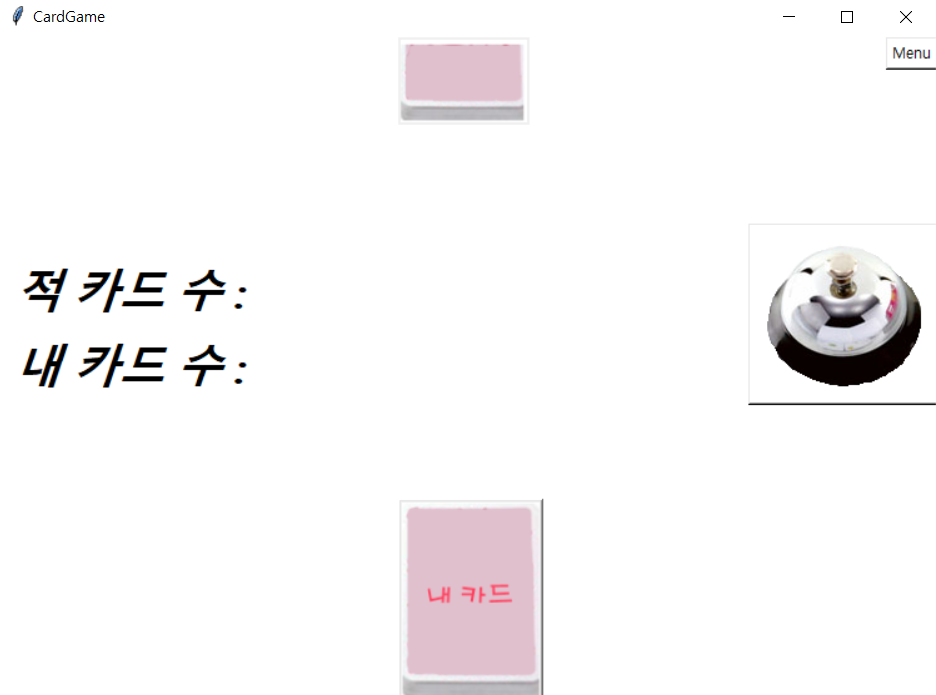
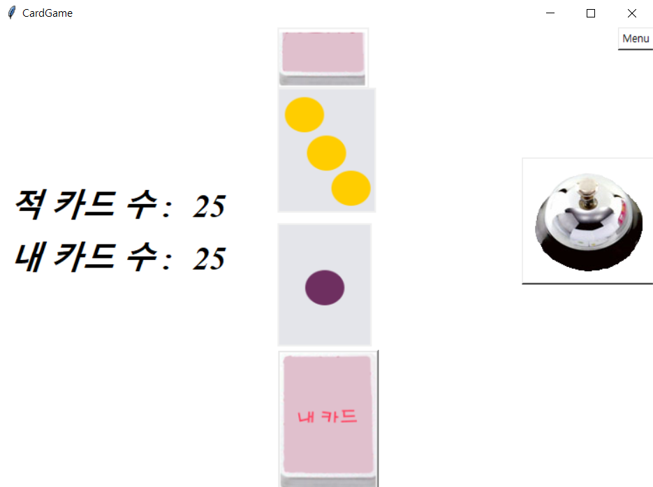
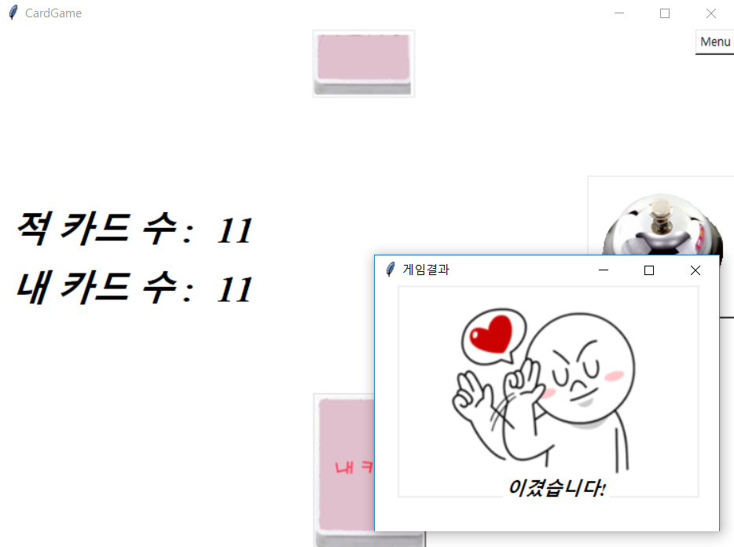

# HaliGali-Card
HaliGali-Card with Python tkinter

> ## Python tkinter 라이브러리를 이용한 할리갈리 보드 게임입니다.

> [개발 언어]: Python  

> [개발 기간]: 1달

> [개발 동기]:  
대학교 1학년 첫 프로그래밍 언어 Python을 배우고 나서 콘솔 기반이 아닌 윈도우 GUI를 학습하였다.  
당시 직접 코딩한 함수 또는 소스코드가 명령어 체계 기반의 콘솔이 아닌 직접 눈으로 보여지는게 너무 신기하여  
이를 통해 게임을 만들고자 하였다. 이에 따라 어렸을 적 재미있게 가지고 논 보드게임 할리갈리를 만들게 되었다.

> [개발 과정]:  

 * 블로그 개발과정: https://blog.naver.com/luh5063014/221309538599  

  - [Python] Tkinter을 이용한 카드게임 만들기 - (1)  
  - [Python] Tkinter을 이용한 카드게임 만들기 - (2)  
  - [Python] Tkinter을 이용한 카드게임 만들기 - (3)

> [게임 사진]:

01  
  

02  
  

03
  

